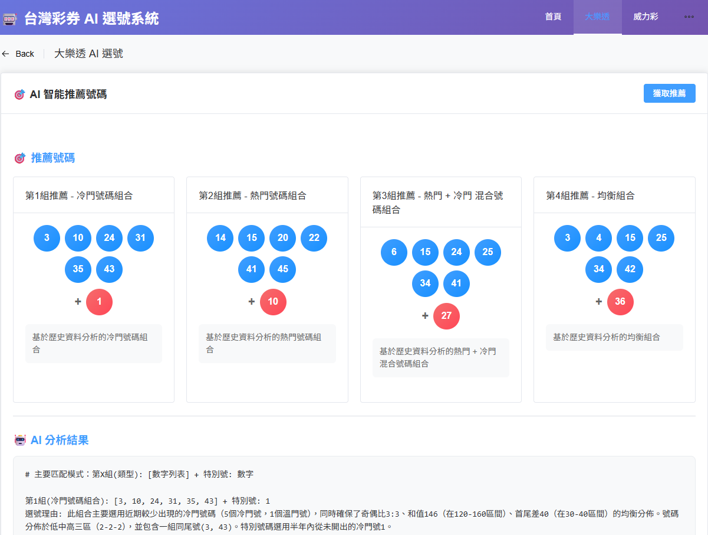

# 台灣彩券 AI 選號系統

[](https://python.org)
[](https://fastapi.tiangolo.com)
[](https://vuejs.org)
[](https://opensource.org/licenses/MIT)

## 📖 專案概述

這是一個結合 **AI 智能分析** 和 **現代化 Web 技術** 的台灣彩券選號系統。專案整合了原有的台灣彩券爬蟲功能，並擴展為全棧 Web 應用，提供智能選號、數據分析和歷史資料查詢服務。



### ✨ 核心特色

- 🤖 **AI 智能選號**：使用 Google Gemini 2.5 Flash 分析半年歷史資料，提供**四組**推薦號碼
- 📊 **數據視覺化**：直觀的號碼頻率統計和趨勢分析
- 🎯 **多彩種支援**：大樂透、威力彩、今彩539 等台灣彩券
- 📱 **響應式設計**：支援桌面、平板、手機等多種設備
- ⚡ **高效能架構**：FastAPI + Vue.js 現代化技術棧
- 🐳 **容器化部署**：Docker Compose 一鍵部署

---

## 🏗️ 系統架構

```
TaiwanLotteryCrawler/
├── 📁 backend/                    # FastAPI 後端服務
│   └── main.py                   # API 路由與業務邏輯
├── 📁 frontend/                   # Vue.js 前端應用
│   ├── src/
│   │   ├── views/                # 頁面元件
│   │   │   ├── Home.vue         # 首頁與快速選號
│   │   │   ├── Lotto649.vue     # 大樂透 AI 選號
│   │   │   ├── SuperLotto.vue   # 威力彩查詢
│   │   │   └── History.vue      # 歷史資料統計
│   │   ├── App.vue              # 主應用元件
│   │   └── main.js              # 應用程式入口
│   ├── nginx.conf               # Nginx 反向代理配置
│   ├── Dockerfile               # 前端容器映像
│   └── package.json             # Node.js 依賴管理
├── 📁 TaiwanLottery/              # 核心爬蟲模組
│   ├── __init__.py              # 主要爬蟲類別
│   └── utils.py                 # 工具函式庫
├── 📁 tests/                     # 單元測試
│   └── test_lottery.py          # 爬蟲功能測試
├── 📁 .github/workflows/         # CI/CD 自動化
│   ├── merge.yaml               # 主分支部署
│   ├── pull_request.yaml        # PR 檢查
│   └── release.yaml             # 版本發布
├── Lottery_predict.py            # AI 預測核心邏輯
├── docker-compose.yml            # Docker 服務編排
├── Dockerfile.backend            # 後端容器映像
├── requirements.txt              # Python 依賴清單
└── setup.py                     # 套件安裝配置
```

---

## 🚀 快速開始

### 📋 環境需求

- **Docker** 和 **Docker Compose** (推薦使用容器化部署)
- 或者：
  - **Python 3.8+** (建議使用 3.10+)
  - **Node.js 16+** 和 **npm**
- **Google AI API Key** (用於 AI 選號功能)

### 🐳 方法一：Docker 部署 (推薦)

```bash
# 1. 克隆專案
git clone https://github.com/stu01509/TaiwanLotteryCrawler.git
cd TaiwanLotteryCrawler

# 2. 建立環境變數檔案
cat > .env << EOF
GOOGLE_AI_API_KEY=your_google_ai_api_key_here
EOF

# 3. 啟動所有服務
docker-compose up -d

# 4. 查看服務狀態
docker-compose ps

# 5. 查看日誌
docker-compose logs -f
```

**服務訪問：**
- 🌐 **前端應用**：http://localhost:8080
- 🔧 **後端 API**：http://localhost:8000
- 📖 **API 文件**：http://localhost:8000/docs

### 💻 方法二：本地開發

```bash
# 1. 克隆專案
git clone https://github.com/stu01509/TaiwanLotteryCrawler.git
cd TaiwanLotteryCrawler

# 2. 設定環境變數
echo "GOOGLE_AI_API_KEY=your_api_key" > .env

# 3. 啟動後端 (終端機 1)
pip install -r requirements.txt
cd backend
python main.py

# 4. 啟動前端 (終端機 2)
cd frontend
npm install
npm run dev
```

**服務訪問：**
- 🌐 **前端應用**：http://localhost:3000
- 🔧 **後端 API**：http://localhost:8000

---

## 🎯 功能說明

### 1. 🏠 首頁 (Home.vue)

- **快速選號**：一鍵獲取 AI 推薦的四組大樂透號碼
- **功能導航**：快速跳轉到各彩種頁面
- **響應式設計**：自動適配手機、平板、桌面

### 2. 🎲 大樂透 AI 選號 (Lotto649.vue)

- **智能分析**：AI 分析過去半年 (約 44 期) 歷史資料
- **四組推薦**：
  1. **冷門號碼組合** - 低頻出現的號碼
  2. **熱門號碼組合** - 高頻出現的號碼
  3. **混合號碼組合** - 熱門與冷門搭配
  4. **均衡組合** - 平衡各項指標
- **詳細分析**：
  - 號碼頻率統計（熱門/冷門前 10 名）
  - 選號理由說明
  - 統計資料概覽
- **視覺化呈現**：圖表化顯示號碼出現頻率

### 3. 🎯 威力彩查詢 (SuperLotto.vue)

- **歷史資料查詢**：依年月查看開獎記錄
- **完整資訊**：期別、日期、第一區、第二區號碼
- **資料匯出**：支援 JSON 格式匯出

### 4. 📊 歷史資料 (History.vue)

- **多彩種支援**：大樂透、威力彩、今彩539
- **彈性查詢**：自訂年月範圍
- **統計分析**：號碼頻率、趨勢分析

---

## 📡 API 端點

### 基本端點

- `GET /` - API 服務資訊
- `GET /health` - 健康檢查

### 大樂透相關

- `GET /api/lotto649` - 獲取大樂透歷史資料
  - **參數**：`year` (年份), `month` (月份)
  - **回應**：期別、開獎日期、獎號、特別號

- `GET /api/lotto649/predict` - AI 智能預測大樂透號碼
  - **功能**：分析半年資料，提供四組推薦號碼
  - **回應**：
    ```json
    {
      "status": "success",
      "data": {
        "total_periods": 44,
        "date_range": { "start": "2025-05-01", "end": "2025-09-30" },
        "frequency_analysis": {
          "hot_numbers": [[5, 15], [14, 14], ...],
          "cold_numbers": [[48, 3], [29, 4], ...]
        }
      },
      "recommended_sets": [
        {
          "type": "冷門號碼組合",
          "regular_numbers": [10, 12, 24, 31, 35, 43],
          "special_number": 7,
          "reason": "基於歷史資料分析的冷門號碼組合"
        },
        // ... 其他三組
      ],
      "ai_prediction": "AI 分析詳細說明..."
    }
    ```

### 其他彩種

- `GET /api/super_lotto` - 威力彩歷史資料 (6/38+1)
- `GET /api/daily_cash` - 今彩539 歷史資料 (5/39)

### API 文件

- **Swagger UI**：http://localhost:8000/docs
- **ReDoc**：http://localhost:8000/redoc

---

## 🛠️ 技術棧

### 後端技術

| 技術 | 版本 | 用途 |
|------|------|------|
| FastAPI | 0.104+ | 高效能 Web 框架 |
| Uvicorn | 0.24+ | ASGI 伺服器 |
| Pydantic | 2.4+ | 資料驗證 |
| Google Generative AI | 0.3+ | Gemini AI 引擎 |
| Requests | 2.31.0 | HTTP 請求 |
| Python-dotenv | 1.0+ | 環境變數管理 |

### 前端技術

| 技術 | 版本 | 用途 |
|------|------|------|
| Vue.js | 3.3+ | 前端框架 |
| Vue Router | 4.2+ | 路由管理 |
| Element Plus | 2.4+ | UI 組件庫 |
| Axios | 1.5+ | HTTP 客戶端 |
| Vite | 4.4+ | 建構工具 |

### 容器化部署

| 技術 | 用途 |
|------|------|
| Docker | 容器化運行環境 |
| Docker Compose | 多容器編排 |
| Nginx | 前端靜態資源服務與反向代理 |

### 開發與測試

| 工具 | 用途 |
|------|------|
| Pytest | 單元測試 |
| Pytest-cov | 測試覆蓋率 |
| Flake8 | 程式碼風格檢查 |
| Pre-commit | Git hooks 管理 |

---

## 🔍 核心模組詳解

### 1. TaiwanLottery 爬蟲模組

**主要類別**：`TaiwanLotteryCrawler`

**資料來源**：`https://api.taiwanlottery.com/TLCAPIWeB/Lottery`

**支援彩種**：
- `lotto649()` - 大樂透 (6/49+特別號)
- `super_lotto()` - 威力彩 (6/38+第二區1號)
- `daily_cash()` - 今彩539 (5/39)
- `lotto1224()` - 雙贏彩 (12/24)
- `lotto3d()` - 3星彩
- `lotto4d()` - 4星彩
- 以及其他彩種...

**資料格式**：
```json
{
  "期別": 114000001,
  "開獎日期": "2025-01-02T00:00:00",
  "獎號": [1, 15, 23, 31, 42, 49],
  "特別號": 7
}
```

### 2. AI 預測模組 (Lottery_predict.py)

**核心功能**：
- `get_six_months_lotto649_data()` - 擷取半年大樂透資料
- `predict_lottery_numbers_with_ai()` - 使用 Google Gemini 2.5 Flash 分析

**AI 分析策略**：
- ✅ 奇偶比分佈 (建議 3:2 或 2:3)
- ✅ 大小號分佈 (小號 1-25，大號 26-49)
- ✅ 避開 3 個以上連號
- ✅ 遺漏號碼追蹤 (5-10 期未出現)
- ✅ 熱門/冷門號碼搭配
- ✅ 分區選號 (低/中/高區)
- ✅ 和值範圍控制 (120-160)

**更新說明**：
- 🆕 從原本的三組推薦擴展為**四組推薦**
- 🆕 新增「均衡組合」類型
- 🆕 所有正則表達式匹配支持第四組解析

### 3. FastAPI 後端服務 (backend/main.py)

**主要功能**：
- RESTful API 端點設計
- CORS 跨域請求處理
- Pydantic 資料驗證
- AI 預測結果解析（支持多種 AI 回應格式）
- 錯誤處理機制
- 健康檢查端點

**AI 回應解析**：
- 支持多種 AI 輸出格式的正則表達式匹配
- 智能提取四組推薦號碼
- 結構化資料回應

### 4. Vue.js 前端應用

**頁面結構**：
- `App.vue` - 主應用框架，導航與佈局
- `Home.vue` - 首頁，快速選號入口
- `Lotto649.vue` - 大樂透專頁，四組 AI 推薦顯示
- `SuperLotto.vue` - 威力彩查詢
- `History.vue` - 歷史資料統計

**UI/UX 特色**：
- 響應式設計（手機 xs/sm，平板 md，桌面 lg）
- 四組號碼卡片佈局（`:md="6"` 一行顯示四組）
- 號碼球視覺化顯示
- 載入動畫與骨架屏
- 錯誤狀態處理

### 5. Docker 容器化部署

**服務編排** (docker-compose.yml)：
- **前端服務** (`frontend`)
  - Nginx + Vue.js 靜態資源
  - Port: 8080 → 80
  - 健康檢查: `/health`

- **後端服務** (`backend`)
  - FastAPI + Uvicorn
  - Port: 8000
  - 健康檢查: `/health`

- **網路**：`lottery-network` (Bridge)

**Nginx 配置** (frontend/nginx.conf)：
- 反向代理：`/api/*` → `http://backend:8000`
- 超時設定：300 秒（AI 分析需時較長）
- CORS 支援
- SPA 路由支援
- Gzip 壓縮

---

## 🔧 開發指令

### Docker 操作

```bash
# 啟動服務
docker-compose up -d

# 查看日誌
docker-compose logs -f [frontend|backend]

# 重新建置
docker-compose build [frontend|backend]

# 停止服務
docker-compose down

# 重啟服務
docker-compose restart [frontend|backend]
```

### 後端開發

```bash
# 執行測試
pytest

# 測試覆蓋率報告
pytest --cov=. tests/ --cov-report=html

# 程式碼風格檢查
flake8 --max-line-length=160

# 開發模式啟動
cd backend && python main.py
```

### 前端開發

```bash
# 開發模式（熱重載）
npm run dev

# 建構生產版本
npm run build

# 預覽生產版本
npm run preview
```

---

## 📊 專案統計

- **程式語言**：Python (後端), JavaScript (前端)
- **程式碼行數**：~3,000+ 行
- **測試覆蓋率**：目標 85%+
- **支援彩種**：9 種台灣彩券
- **AI 推薦組數**：4 組號碼
- **API 端點**：6 個主要端點
- **版本**：v1.5.1

---

## 🔒 安全性與隱私

### 資料安全

- ✅ **HTTPS 連線**：所有 API 請求使用 TLS 加密
- ✅ **API Key 保護**：環境變數儲存敏感資訊（`.env` 不納入版控）
- ✅ **無個人資料**：系統不收集使用者個人資訊
- ✅ **本地處理**：AI 分析在本地伺服器執行

### API 安全

- ✅ **CORS 設定**：限制跨域請求來源
- ✅ **請求驗證**：Pydantic 模型驗證所有輸入
- ✅ **錯誤處理**：安全的錯誤訊息回應

---

## ⚠️ 重要注意事項

### 免責聲明

1. **娛樂用途**：本系統僅供娛樂和學習參考
2. **無中獎保證**：AI 推薦不保證中獎結果
3. **理性投注**：請量力而為，避免過度投注
4. **風險自負**：使用者需自行承擔投注風險

### 技術需求

1. **API Key 必要**：AI 功能需要有效的 [Google AI API Key](https://aistudio.google.com)
2. **網路連線**：需要穩定的網際網路連線
3. **瀏覽器支援**：建議使用現代瀏覽器 (Chrome 90+, Firefox 88+, Safari 14+)
4. **效能建議**：建議 4GB+ RAM 以獲得最佳體驗

---

## 🤝 貢獻指南

### 如何貢獻

1. **Fork** 專案到您的 GitHub 帳戶
2. **建立分支**：`git checkout -b feature/amazing-feature`
3. **提交變更**：`git commit -m 'Add amazing feature'`
4. **推送分支**：`git push origin feature/amazing-feature`
5. **建立 Pull Request**

### 回報問題

使用 [GitHub Issues](https://github.com/stu01509/TaiwanLotteryCrawler/issues) 回報問題，請提供：
- 詳細的錯誤描述和重現步驟
- 系統環境資訊 (OS, Python/Node.js 版本)
- 相關日誌或截圖

---

## 📝 更新日誌

### v1.5.1 (最新)
- ✨ **新增**：AI 推薦從三組擴展為**四組**
- ✨ **新增**：第四組「均衡組合」推薦
- 🐛 **修復**：Nginx 反向代理配置（使用 Docker 服務名稱）
- 🐛 **修復**：AI 分析超時問題（增加 300 秒超時設定）
- 🔧 **優化**：前端佈局適配四組號碼顯示
- 🔧 **優化**：後端正則表達式支持四組號碼解析

### v1.5.0
- ✨ **新增**：Docker 容器化部署支援
- ✨ **新增**：Nginx 反向代理
- ✨ **新增**：健康檢查機制

### v1.4.0
- ✨ **新增**：AI 智能選號功能
- ✨ **新增**：Google Gemini 2.5 Flash 整合
- ✨ **新增**：號碼頻率統計分析

---

## 🔗 相關連結

- **專案首頁**：[GitHub Repository](https://github.com/stu01509/TaiwanLotteryCrawler)
- **問題回報**：[GitHub Issues](https://github.com/stu01509/TaiwanLotteryCrawler/issues)
- **台灣彩券官網**：[taiwanlottery.com](https://www.taiwanlottery.com)
- **Google AI Studio**：[aistudio.google.com](https://aistudio.google.com)

---

## 📄 授權條款

本專案採用 **MIT License** 授權條款。詳細內容請參閱 [LICENSE](LICENSE) 檔案。

---

<div align="center">

**🎯 Made with ❤️ for Taiwan Lottery Enthusiasts**

如果這個專案對您有幫助，請給我們一個 ⭐ Star！

</div>
